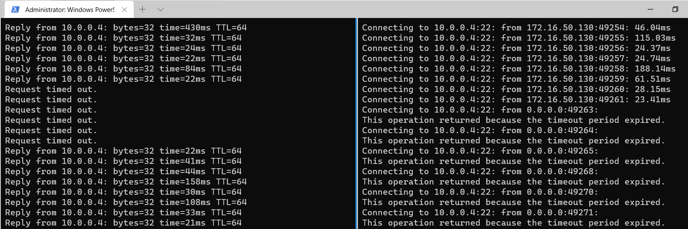

# Azure P2S VPN connectivity instability (Repro Lab)

## Goal

The goal of this lab is to reproduce connectivity instability observed between P2S Clients connecting over VPN Gateway using an ASN different of 65515 when ExpressRoute VPN Gateway is also present on the VNET.

## Deploy based LAB

Deploy base lab environment. It will create the following components:

- Hub VNET (10.0.0.0/24)
    - Linux VM: az-hub-lxvm - 10.0.0.4 
    - VPN Gateway Active/Active + P2S enabled: az-hub-vpngw
    - VPN Gateway ASN: 65515
    - P2S address pool: 172.16.50.0/24
    - ExpressRoute Gateway Standard SKU: az-hub-ergw
- Spoke 1 VNET (10.0.1.0/24)
    - az-spk1-lxvm (10.0.1.4)
- Spoke 2 VNET (10.0.2.0/24)
    - az-spk2-lxvm (10.0.2.4)

 Hub with ER and VPN Gateway + VM and two Spokes with one VM on each.
VPN Gateway will be deployed with ASN 65515 and later we will repro the issue by change it to different ASN like 65100.

### Prerequisites

- Log in to Azure Cloud Shell at https://shell.azure.com/ and select Bash
- Ensure Azure CLI and extensions are up to date:
  
  `az upgrade --yes`
  
- If necessary select your target subscription:
  
  `az account set --subscription <Name or ID of subscription>`
  
- Clone the  GitHub repository:
  
  `git clone https://github.com/dmauser/azure-p2s-er-issue-repro`
  
  - Change directory:
  
  `cd ./azure-p2s-er-issue-repro`
  
  - Make deployment script executable:

  `chmod +xr deploy.sh`

  - Run deployment script:
  
  `./deploy.sh`

  - You will be prompted to input on two parameters:
  
    **VmAdminUsername** - set your own username

    **VmAdminPassword** - set your own password  

Deployment takes approximately 30 minutes.

**Note:** you can adjust deploy.sh script based in your requirements using vi or nano editor over Cloud Shell.

Default parameters:

```Bash
#Set parameters (modify for your needs)
rg=p2s-er-repro #Resource Group Name
location=centralus #Region
mypip=$(curl -4 ifconfig.io/ip -s) #if you are deploying over Cloudshell set that manually mypip=1.1.1.1
```

### Configure P2S VPN Client

**Note:** Azure VM VPN Client is not provisioned as part of this lab. You have to deploy your own Windows VM.

You need to go over two steps to get your P2S VPN Client ready:

1) Install IKEv2 VPN Client

   Using VPN Client packet output URL from Cloud Shell.

   Extract the zip file and install VpnClientSetupAmd64.exe under WindowsAmd64 folder.

   Note: You may be prompted by Windows protected your PC. Click in More Info - set Run anyway.

2) Run the following PowerShell script to install client Certificate and psping Sysinternals tool to test connectivity over TCP port.

```powershell
#Install Certificate on P2SVPN Client (To be executed over Powershell on P2S VPN)
Start-BitsTransfer -source https://github.com/dmauser/azure-p2s-er-issue-repro/raw/main/cert/labuser.pfx -destination "$env:temp\labuser.pfx"
$mypass="Password1234" | ConvertTo-SecureString -AsPlainText -Force
Import-PfxCertificate -FilePath $env:temp\labuser.pfx -CertStoreLocation Cert:\LocalMachine\My -Password $mypass
# Install sysinternals psping tool
Start-BitsTransfer -source "https://live.sysinternals.com/psping.exe" -destination "$env:windir\system32\psping.exe"
```

## Validate connectivity

Connected P2S VPN and Check connectivity to Hub and Spoke VMs using ping and psping to SSH port for the following targets:

Note: you can open a command prompt for each one of the commands and leave it running.

-  HubVM

   `ping -t 10.0.0.4`

   `psping -t 10.0.0.4:22`

- Spoke1 VM

   `ping -t 10.0.1.4`

   `psping -t 10.0.1.4:22`

- Spoke2 VM

   `ping -t 10.0.1.4`

   `psping -t 10.0.1.4:22`

Note: If you are using Windows 11 you can use Windows Terminal and Split screen to leave both commands above running.

Expected working output is:


## Repro the issue

Set variables:

```Bash
rg=p2s-er-repro #Resource Group Name
gwname=Az-Hub-vpngw
vnet=Az-Hub-vnet
```

Change the ASN to 65050

1) Return to Cloud shell and run the following command:

   `az network vnet-gateway update -g $rg -n $gwname --asn 65050`

2) Check the status of psping connectivity over P2S and you may see connectivity failing. Ping (icmp) may start fail during the ASN configuration but it may start to work back fine. However you should see psping failing.



## Resolving the issue

You can resolve the issue by either running one of the options below:

Set variables:

```Bash
rg=p2s-er-repro #Resource Group Name
gwname=Az-Hub-vpngw
vnet=Az-Hub-vnet
```

1) Option 1: Set VPN Gateway to 65515 = resolves the issue

   `az network vnet-gateway update -g $rg -n $gwname --asn 65515`

2) Option 2: Delete ExpressRoute Gateway:

   `az network vnet-gateway delete -g $rg -n Az-Hub-ergw`

## Clean up

- Remove **p2s-er-repro** resource group via Portal or Cloud Shell

  `az group delete --name  p2s-er-repro`

- Remove folder **azure-p2s-er-issue-repro** over Cloud Shell

  `rm -rf azure-p2s-er-issue-repro`
